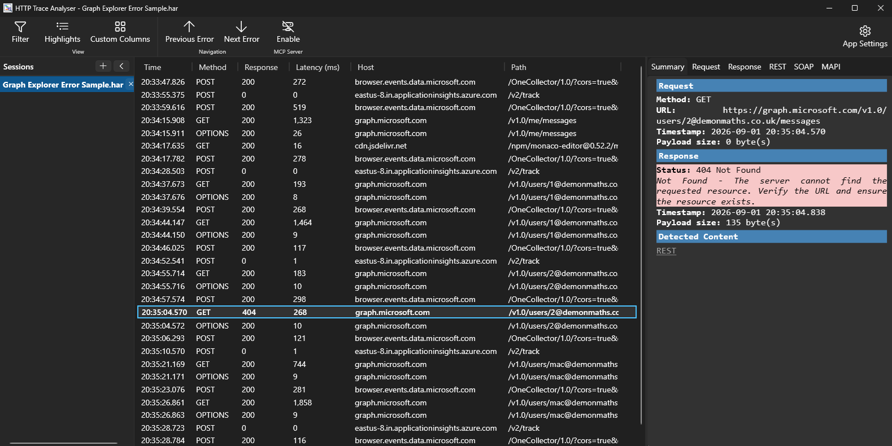
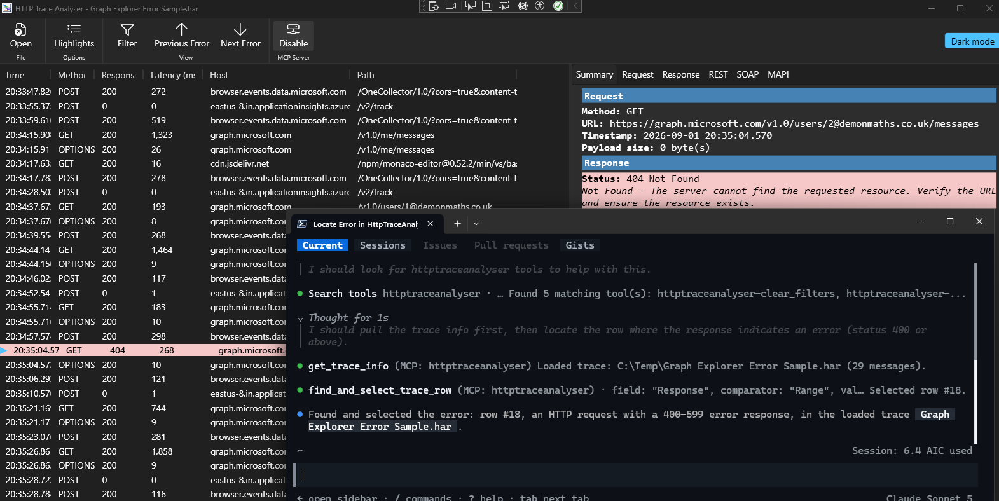

# HTTP Trace Analyser

A Windows desktop app for opening HTTP trace captures produced by different tools, browsing the request/response list, filtering and highlighting rows of interest, and inspecting individual request/response bodies with format-aware viewers.

Built with WPF on **.NET 10** (`net10.0-windows`).



## Supported trace formats

| Extension | Source | Notes |
| --- | --- | --- |
| `.saz` | Fiddler Session Archive | Request/response bodies, headers, and per-session timers extracted from the `raw/` entries. |
| `.har` | HTTP Archive 1.2 (Chrome/Edge/Firefox DevTools, browser extensions) | Bodies decoded via the `content.text` / `postData.text` fields, `base64` encoding honoured. |
| `.etl` | Event Trace for Windows | Best-effort extraction from `Microsoft-Windows-WinHTTP`, `Microsoft-Windows-WinINet`, and `Microsoft-Windows-HttpService` providers via [`Microsoft.Diagnostics.Tracing.TraceEvent`](https://www.nuget.org/packages/Microsoft.Diagnostics.Tracing.TraceEvent). Bodies are usually absent in ETL captures; header-level metadata is recovered. |
| `.trace` (also `.log`/`.txt` by content sniffing) | EWS (Exchange Web Services) API trace | `<Trace Tag="Ews...HttpHeaders/Request/Response" Tid="...">` elements are correlated by `Tid` to rebuild request/response pairs, including headers and SOAP bodies. |

Additional formats can be plugged in by subclassing `HttpTraceFile` and calling `HttpTraceFile.RegisterLoader(".ext", path => new MyTraceFile(path))`.

## How it works

### In-memory storage

`Model/HttpTraceFile` owns a `System.Data.DataTable` named **Messages** with one row per request/response pair. Columns include the display fields (`Date`, `Time`, `Method`, `Response`, `Url`, `Host`, `Path`), timestamps, serialized headers, payload BLOBs, and pre-computed highlight brushes.

The `ListView` binds to `DataTable.DefaultView`, which gives free **grid virtualization**, **sorting**, and **filtering** without materialising a wrapper object per row. This keeps the UI responsive on multi-GB traces.

### Trace list

- **Column visibility** — right-click any column header to toggle columns on/off.
- **Sort** — left-click a header to cycle **none ▸ ascending ▲ ▸ descending ▼**. Powered by `DataView.Sort` so sorting is O(n log n) on the underlying table.
- **Row removal** — right-click a row → *Remove* to drop selected rows.

### Highlighting

`Model/HighlightRule` + `HighlightRuleSet` describe row-colour rules. A rule matches on a column (`Response`, `Method`, `Host`, `Path`, `Url`, `Date`, `Time`) using one of `Equals`, `NotEquals`, `Contains`, `StartsWith`, `Regex`, or `Range` (numeric `min-max`, e.g. `400-599`).

Defaults ship with:

- `429` → light yellow
- `200-299` → light green
- `400-599` → light red

Rules are managed from **Highlights** in the toolbar. First matching enabled rule wins; the resulting `Brush` is stored in the row's `RowBackground` / `RowForeground` columns and consumed by the `ListView` `ItemContainerStyle`.

### Filtering

`Model/FilterRule` + `FilterRuleSet` build a `DataView.RowFilter` expression from a list of rules. Each rule contributes `Field`, `Comparator` (`Equals`, `NotEquals`, `Contains`, `StartsWith`, `Range`), a `Value`, and a `Combinator` (`AND` / `OR`) applied left-to-right.

Toggle the filter panel with the **Filter** toolbar button. Rules can be added/removed live; the trace view re-filters immediately.

### Viewers

Selecting a row populates these tabs:

- **Summary** — request/response metadata (method, URL, timestamp, payload size, status).
- **Request** — headers on top, payload below, with a horizontal `GridSplitter`.
- **Response** — same layout as Request.
- **REST** — shown for requests recognised as REST API calls (e.g. Microsoft Graph style URLs, via `Model/RestAnalyzer.cs`): decomposed path segments, API version, and query parameters, plus a JSON tree view of the payload.
- **SOAP** — shown for SOAP requests/responses (e.g. EWS calls, via `Model/SoapAnalyzer.cs`): decoded SOAP header entries (including anchor mailbox) and envelope summary.
- **MAPI** — decoded MS-OXCMAPIHTTP metadata for traces of MAPI-over-HTTP traffic (protocol headers + response meta-tag stream + hex dump of the body). Full ROP decoding is out of scope; see [Office-Inspectors-for-Fiddler/MAPIInspector](https://github.com/OfficeDev/Office-Inspectors-for-Fiddler/tree/main/MAPIInspector) for a complete decoder.

The REST and SOAP tabs are only shown when the request/response content is recognised as such; otherwise they're hidden.

Layout rules for Request / Response:

- If a payload is present, headers are capped at half the viewer height; the payload gets the rest.
- If no payload, the headers section expands to the whole viewer and a `(no payload)` message is shown below.

### Payload format viewer

The payload picker offers:

| Format | Behaviour |
| --- | --- |
| Plain text | Decoded via `Content-Type` charset (fallback UTF-8), no highlighting. |
| JSON | Pretty-printed via `System.Text.Json`, AvalonEdit JSON highlighting. |
| XML | Pretty-printed via `XDocument`, AvalonEdit XML highlighting. |
| HTML | AvalonEdit HTML highlighting (no pretty-printing — HTML isn't necessarily well-formed). |
| JavaScript | AvalonEdit JavaScript highlighting. |
| Image | PNG / JPEG / GIF / BMP / TIFF / ICO rendered via WPF's built-in codecs. |
| SVG | Rendered as live WPF vector via [SharpVectors.Reloaded](https://github.com/ElinamLLC/SharpVectors). |

The format is auto-selected from `Content-Type` and can be overridden per side via the ComboBox. Text formats route through an [AvalonEdit](https://github.com/icsharpcode/AvalonEdit) `TextEditor` for syntax highlighting; images/SVGs are shown in scrollable overlays sharing the same cell.

### Word wrap

Every viewer's context menu includes **Word wrap** (default off), alongside **Copy** and **Select all**.

## MCP server (GitHub Copilot CLI integration)

HttpTraceAnalyser can host an in-process [Model Context Protocol](https://modelcontextprotocol.io/) server, letting you drive the running app from the **GitHub Copilot CLI** — search the loaded trace, add highlight/filter rules, and select specific rows so they appear in the viewers, all via natural-language prompts.

### Enabling the server

1. Open a trace and click **Enable** in the **MCP Server** ribbon group (rightmost group in the toolbar). The button switches to **Disable** once the server is listening.
2. The server binds to `http://127.0.0.1:5088` (loopback only — it is not reachable from other machines).
3. Click **Disable** (or close the app) to stop it. The server is also stopped automatically on application exit even if left enabled.

The listening port is defined by `McpHostManager.Port` in [`McpHostManager.cs`](McpHostManager.cs) if you need to change it.

### Registering with GitHub Copilot CLI

With the app running and the MCP server enabled, add it as an HTTP MCP server in your Copilot CLI MCP configuration file:

```json
{
  "mcpServers": {
    "httptraceanalyser": {
      "type": "http",
      "url": "http://127.0.0.1:5088"
    }
  }
}
```

Verify it's registered with:

```pwsh
gh copilot mcp list
```

### Available tools

Exposed from [`Mcp/TraceMcpTools.cs`](Mcp/TraceMcpTools.cs):

| Tool | Purpose |
| --- | --- |
| `GetTraceInfo` | Returns the loaded trace's file path and message count. |
| `SearchTrace` | Searches URL/Host/Path/Method columns for matching rows. |
| `HighlightTrace` | Adds a highlight rule (column/operator/value/colors) to `HighlightRuleSet`. |
| `ClearHighlights` | Removes all highlight rules. |
| `FilterTrace` | Adds a filter rule (field/comparator/value/combinator) to `FilterRuleSet`. |
| `ClearFilters` | Removes all filter rules. |
| `SelectTraceRow` | Selects a row by its `Index` column value so it populates the viewers. |
| `FindAndSelectTraceRow` | Finds the first row matching a field/comparator/value across the whole trace (ignoring active filters) and selects it. |

Example prompts once the CLI is connected:

- *"How many messages are in the loaded trace?"*
- *"Highlight every row where the host contains 'contoso.com' in orange."*
- *"Filter the trace to only show POST requests."*
- *"Select the first request that returned a 500 error."*

All tool calls are marshaled onto the UI thread, so results appear live in the running window — no need to switch back to the app to see the effect. For example, asking the CLI to locate an error selects the matching row in HttpTraceAnalyser so it's shown in the viewers:



## Building and running

Requires the **.NET 10 SDK** and Windows.

```pwsh
git clone https://github.com/MWC-Developer/HttpTraceAnalyser.git
cd HttpTraceAnalyser
dotnet run --project HttpTraceAnalyser.csproj
```

Or open `HttpTraceAnalyser.slnx` in Visual Studio 2026 (or newer) and press **F5**.

## Dependencies

| Package | Purpose |
| --- | --- |
| [AvalonEdit](https://www.nuget.org/packages/AvalonEdit) | Text editor with syntax highlighting for the payload viewers. |
| [Microsoft.Diagnostics.Tracing.TraceEvent](https://www.nuget.org/packages/Microsoft.Diagnostics.Tracing.TraceEvent) | Managed ETW parser used by the `.etl` loader. |
| [SharpVectors.Reloaded](https://www.nuget.org/packages/SharpVectors.Reloaded) | WPF SVG rendering. |
| [ModelContextProtocol.AspNetCore](https://www.nuget.org/packages/ModelContextProtocol.AspNetCore) | Hosts the in-process MCP server used for GitHub Copilot CLI integration. |
| [Microsoft.Extensions.Hosting](https://www.nuget.org/packages/Microsoft.Extensions.Hosting) | Generic host used to run the MCP server alongside the WPF UI. |

## Project layout

```
HttpTraceAnalyser/
├─ HttpTraceAnalyser.csproj    // net10.0-windows, WPF
├─ App.xaml / App.xaml.cs      // application entry point
├─ MainWindow.xaml(.cs)        // trace list, viewers, toolbar, filter panel
├─ HighlightsWindow.xaml(.cs)  // highlight rule editor
├─ McpHostManager.cs           // starts/stops the in-process MCP HTTP server
├─ Mcp/
│  └─ TraceMcpTools.cs         // MCP tools exposed to GitHub Copilot CLI
└─ Model/
   ├─ HttpMessage.cs           // HttpMessage / HttpRequest / HttpResponse
   ├─ HttpTraceFile.cs         // DataTable-backed base + loader registry
   ├─ SazTraceFile.cs          // Fiddler .saz loader
   ├─ HarTraceFile.cs          // HAR 1.2 loader
   ├─ EtlTraceFile.cs          // ETW .etl loader
   ├─ EwsTraceFile.cs          // EWS .trace loader
   ├─ HighlightRule.cs         // row-highlighting rules
   ├─ FilterRule.cs            // DataView filter rules
   ├─ RestAnalyzer.cs          // REST API URL analysis for the REST tab
   ├─ SoapAnalyzer.cs          // SOAP envelope/header analysis for the SOAP tab
   └─ MapiHttpDecoder.cs       // minimal MAPI/HTTP decoder for the MAPI tab
```

## Extensibility notes

- **Add a new trace format**: subclass `HttpTraceFile`, populate rows via `AddRow(request, response)`, register with `HttpTraceFile.RegisterLoader(".ext", ...)`.
- **Add a payload format**: extend the `PayloadFormat` enum in `MainWindow.xaml.cs`, add a `ComboBoxItem`, extend `DetectPayloadFormat` and `RenderPayload`.
- **Add a highlight/filter column**: add the value to `HighlightColumn` / `FilterField`, ensure the `DataTable` schema has a matching column name (see `TraceDataSchema`).

## License

MIT License - see [LICENSE.txt](LICENSE.txt) for details.
